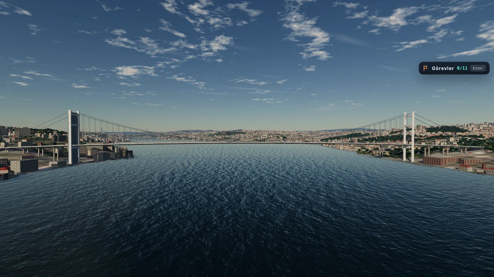
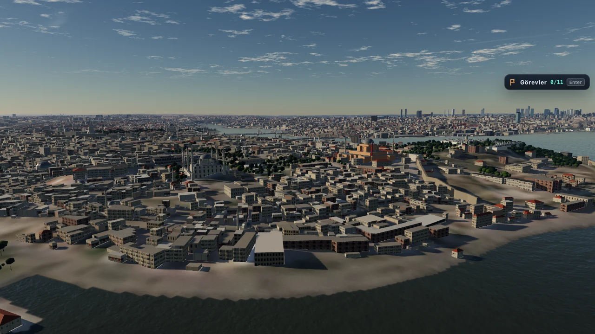
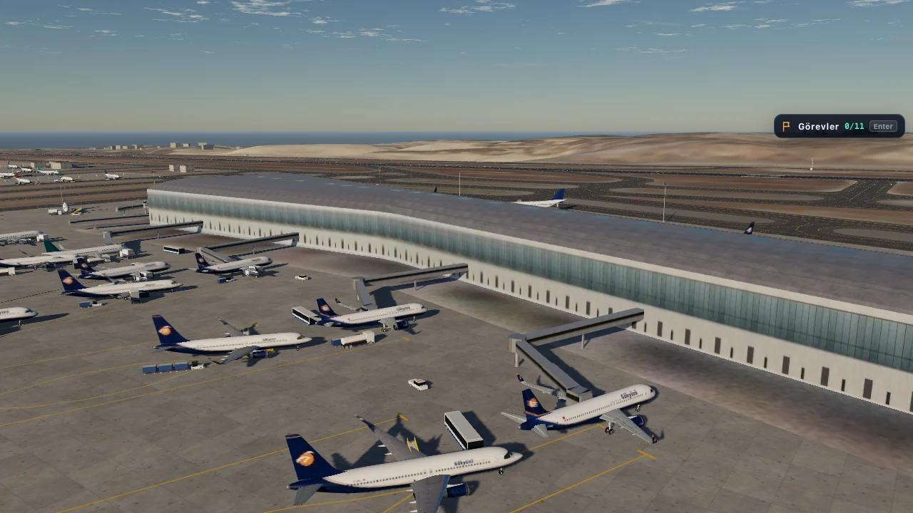
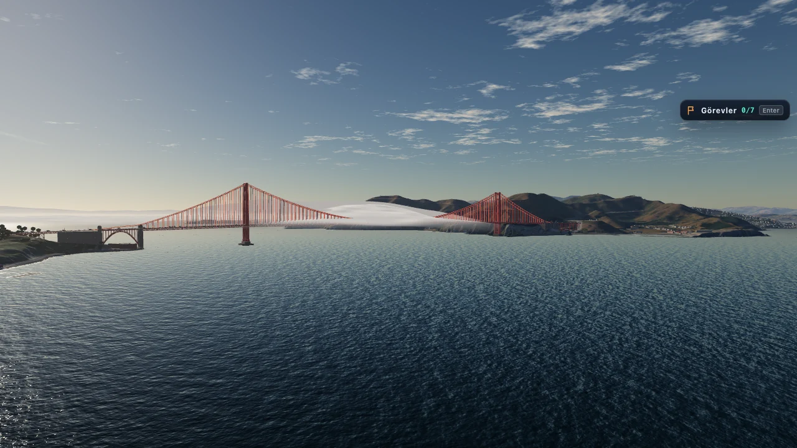
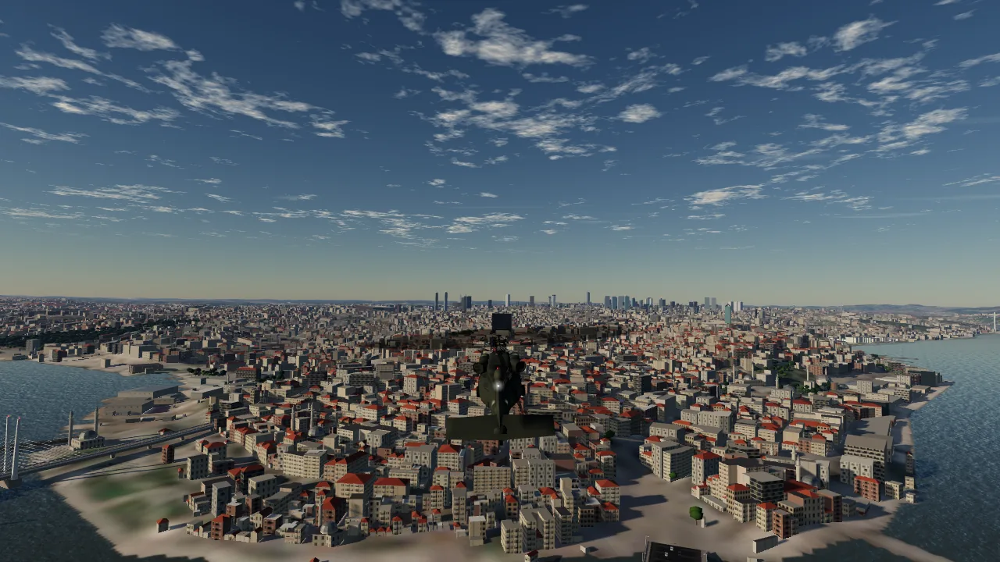
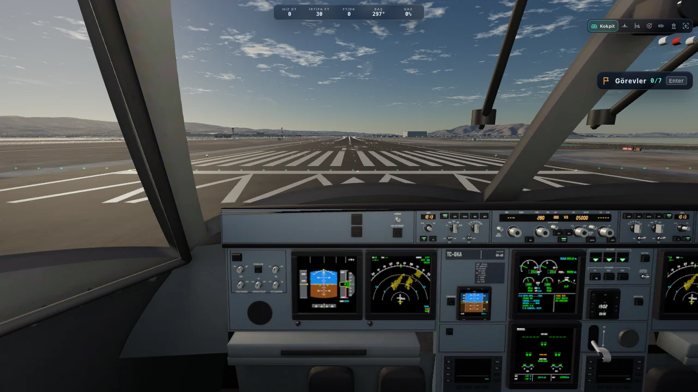
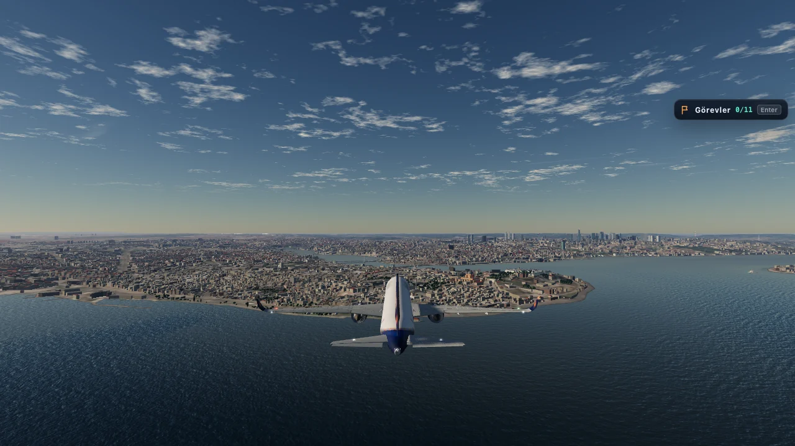
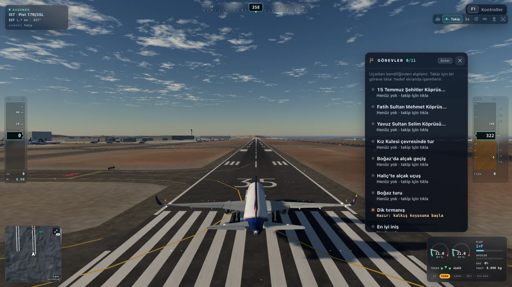

# Gökyüzü

**A free flight simulator that runs in the browser, over the real San Francisco Bay Area and İstanbul.**
Five aircraft with their own flight models and working cockpits, missions, and an online leaderboard. It is written in
JavaScript with [three.js](https://threejs.org) (WebGL 2), needs no install or plug-in, and runs on desktops, tablets
and phones.

▶ **Play:** <https://fs.erenailab.com> · [Türkçe](#türkçe)

| | |
|---|---|
|  |  |
|  |  |
|  |  |
|  |  |

*Screenshots use the trademark-free asset pack (fictional liveries).*

## Features

- **Two maps:**
  - **San Francisco Bay:** USGS 3DEP terrain and NAIP aerial imagery; SFO, Oakland and the former Alameda air
    station; the Golden Gate and Bay Bridge; the city's buildings and street trees from DataSF; bay bathymetry.
  - **İstanbul:** Copernicus DEM terrain and Sentinel-2 imagery; İstanbul Airport (LTFM), Sabiha Gökçen and Atatürk
    with runways from the published AIP; the Bosphorus bridges, the historic peninsula and the skyline; buildings
    from OpenStreetMap and Overture Maps.
- **Five aircraft,** each with its own flight model, a 3D cockpit and live avionics:
  - F-16C (fly-by-wire limits, afterburner, HUD, MFDs, DED);
  - F-22A (high angle of attack, thrust vectoring, glass cockpit);
  - A320neo (normal-law protections, ECAM, autothrust, ILS autoland);
  - 737-800 (yoke, stick shaker, six display units and CDUs, autobrake, reversers);
  - UH-60M (AFCS hover hold, ground effect, translational lift, vortex ring state, autorotation).
- **Missions:** 10 in San Francisco and 19 in İstanbul at three levels, a daily mission, free-flight challenges
  (10 + 16) detected while you fly freely, a landing score, and realistic failures (engine, fire, hydraulics, gear,
  tail rotor).
- **Leaderboard:** anonymous by default, with an optional nickname.
- **Navigation:** a big map with route planning, direct-to and runway approaches flown by an LNAV autopilot, ILS and
  autoland.
- **Sound:** engines, rotor, wind and systems in WebAudio (Doppler, air absorption), per-aircraft aural alerts and
  voice callouts.
- **Controls:** keyboard (platform-aware), gamepad, and touch (floating stick, throttle slider, optional tilt
  steering).
- **Runs on phones:** quality presets per device class, adaptive resolution, frame pacing, streaming budgets, and a
  first-flight tutorial for each kind of aircraft.
- **Language:** the game's text is Turkish. An English interface is a [starter task](docs/good-first-issues.md).

## Tech stack

| Part | Tools |
|---|---|
| Game | three.js 0.186 (WebGL 2), plain ES modules without a framework, WebAudio; glTF with Draco / meshopt geometry and KTX2 (Basis Universal) textures; esbuild for the code-split production bundle |
| Asset pipeline | Python 3.12 (numpy, scipy, rasterio, pyproj, shapely, pyosmium, pyarrow, Pillow); Blender 5.2, where every model is a procedural Python script; Node tools (glTF-Transform, sharp, meshoptimizer); KTX-Software |
| Live site | Static hosting on S3 + CloudFront behind Cloudflare; the leaderboard on AWS Lambda + DynamoDB under the game's own origin |
| Tests | Plain Node test scripts in `tests/`; Playwright scripts in `tools/qa/` and `tools/perf/` |

## Quick start

You need [Node.js](https://nodejs.org) 22 or newer and git.

```sh
git clone https://github.com/erendikmenn/REPO_NAME.git
cd REPO_NAME
npm install
```

The game assets are not in git ([how assets work](#how-assets-work)). Choose one way to get them:

**A. The asset pack** (recommended). Download the trademark-free asset pack from GitHub Releases, verify it, then serve:

```sh
node tools/assets/fetch_pack.mjs
node tools/serve.mjs            # → http://localhost:5173/
```

**B. On demand, for a fast start.** The dev server fetches each file the game asks for from the live site, once, and
caches it in `.cache/assets/`; local files always win:

```sh
node tools/serve.mjs --assets-from https://fs.erenailab.com      # → http://localhost:5173/ (npm run dev: the same)
```

Use it for normal play and testing only: please do not script bulk downloads. Files fetched from the live site are
for developing and testing Gökyüzü, not for redistribution, and they may include brand liveries that are not part of
the repository or the asset pack.

**Direct links** skip the menu: `?map=ist`, `?aircraft=f16&spawn=AIR-GGB`, `?mission=ist-halic`.

- Aircraft: `f16`, `f22`, `a320neo`, `b737`, `uh60`.
- San Francisco start points: `KSFO-28R`, `KSFO-28L`, `KSFO-01R`, `KNGZ-24`, `KNGZ-06`, `KOAK-30`, `AIR-GGB`,
  `AIR-SFO-FINAL`, `AIR-CITY`. İstanbul's start points are listed in the menu.
- Testing on other devices from a desktop: `?device=phone&touch=1`, `?device=tablet&touch=1`,
  `?device=integrated`; `?quality=low|medium|high|ultra`; `?fps=30|60|0`.
- Usage beacons are off on `localhost`; `?telemetry=0` turns them off anywhere.

### Controls (keyboard)

| Key | Action |
|---|---|
| W / S, ↑ / ↓ | Pitch down / up |
| A / D, ← / → | Roll left / right |
| Q / E | Rudder (nose-wheel steering on the ground) |
| X / Z, + / −, Shift / Ctrl | Throttle up / down (collective in the helicopter). Ctrl only on a Mac: elsewhere Ctrl+W closes the tab |
| 1 … 9, 0 | Throttle 10 % … 90 %, 100 % |
| G · F / V · K · N | Gear · flaps down / up · speed brake · reverse thrust |
| O | Autopilot (ILS approach in the airliners, hover hold in the helicopter) |
| B / Space | Brakes |
| C, `,` / `.` · Alt + 1 … 7 | Cycle cameras · choose a camera directly (Option on a Mac) |
| T · Y | Cockpit / outside · look back |
| R · P / Esc · H · M | Restart · pause · HUD · sound |
| F1 / ? · Tab | Help (all keys) · main menu |

Fighters stop at MIL power: press throttle-up once more for afterburner. A standard-mapping gamepad works too, and on
phones and tablets the game shows touch controls.

## How assets work

The code is in git. The **built assets are not**: the models, textures, terrain and city tiles, and sounds under
`assets/` take about 6 GB on a build machine, of which about 2.8 GB are published. At runtime the game requests every
file from `assets/…` next to the page, as `<file>?v=<hash>`. The hashes come from `assets/versions.json` (one per
directory, written by `tools/deploy/build_dist.mjs`), so a changed file gets a new URL.

There are three ways to have them locally:

1. **The asset pack** on GitHub Releases, fetched and verified by `node tools/assets/fetch_pack.mjs`. It is
   trademark-free and licensed under CC BY-NC 4.0 ([ASSETS-LICENSE.md](ASSETS-LICENSE.md)).
2. **The on-demand mode** of the dev server, `node tools/serve.mjs --assets-from [<URL>]` (default
   `https://fs.erenailab.com`): one file at a time, only when the page asks for it and it is missing locally, cached
   in `.cache/assets/`; local files always win, so you can rebuild one aircraft or map and keep the rest remote. A
   first flight on one map downloads roughly 50–130 MB. For development and testing only
   ([tools/README.md](tools/README.md) §1).
3. **Build them yourself** from source (next section).

The live game at <https://fs.erenailab.com> may show brand liveries (for example a real airline's) that are built
locally by the maintainer and are **not** part of this repository or the asset pack. The repository's build scripts
paint a fictional house livery and fictional military markings.

## Rebuilding the assets

Everything in `assets/` is generated by scripts in this repository: Python pipelines in `tools/geo/`, `tools/audio/`
and `tools/assets/`, and Blender scripts in `blender/`. A full rebuild downloads about 11 GB of source data, needs
about 30 GB of free disk and takes roughly a day of machine time.

- **Setup and every step:** see [tools/README.md](tools/README.md) (prerequisites, the order of the pipelines, disk
  and time, the ops scripts).
- **Machine:** macOS today, because several texture scripts rasterise macOS system fonts; patches that make the
  pipeline portable are welcome ([starter task 12](docs/good-first-issues.md#12-open-fonts-in-the-blender-texture-scripts)).
- **Tools:** Python 3.12 with [`requirements.txt`](requirements.txt)
  (`python3.12 -m venv .venv && .venv/bin/pip install -r requirements.txt`); Blender 5.2 (set `$BLENDER` if it is not
  in the default place); `node tools/assets/setup.mjs` for the Node tools and KTX-Software (pinned,
  checksum-verified).
- **Order:** terrain and imagery (`tools/geo/terrain_*.py`, `imagery_*.py`) → city and airports (`tools/geo/city_*.py`,
  `airports_*.py`, `blender/city`, `blender/airports`) → landmarks (`tools/geo/landmarks_*.py`, `blender/landmarks*`) →
  aircraft (`blender/aircraft/<id>/make_all.sh`) → audio (`tools/audio/build_all.py`) → minimaps
  (`src/ui/tools/bake_*_map.py`) → textures and packs (`tools/assets/textures.mjs`, `packs.mjs`, `city_meshopt.mjs`).
  Run the geo pipelines with `GEO_REGION=sf` or `GEO_REGION=ist`. [CONTRACTS-SF.md](CONTRACTS-SF.md) and
  [CONTRACTS-IST.md](CONTRACTS-IST.md) document the formats and each step.
- **Sources:** USGS 3DEP, NAIP, NOAA and DataSF for San Francisco; Copernicus DEM, Sentinel-2 and EMODnet for
  İstanbul; OpenStreetMap and Overture Maps for both. Downloads use a generic User-Agent.
- **Brands stay local:** the scripts paint the fictional "Gökyüzü" livery and generic markings by default. Real
  liveries or insignia can only come from a local directory outside git (`blender/common/brand.py`) and must never be
  committed or published.
- **Voices:** regenerating the ElevenLabs voices needs your own ElevenLabs API key; everything else is synthesised
  locally.

A production build of the code: `node tools/deploy/build_dist.mjs` writes `dist/`; serve it with
`node tools/serve.mjs --root dist`. The maintainer's deploy scripts (`tools/deploy/deploy.sh`) read their
infrastructure ids from a local config file: see `tools/deploy/deploy.env.example`.

## Tests and CI

The tests are plain Node scripts without a framework. Each prints a PASS / FAIL table and exits with 1 on a failure:

```sh
for f in tests/*.test.mjs; do node "$f" || exit 1; done      # or: npm test
```

They cover the flight models, missions (flown by the real flight models against fake worlds), navigation and
autoland, frame pacing, graphics fallbacks, maps, the leaderboard service and client, and asset URLs. The `packs`,
`terrain` and parts of the `assets` tests check the built assets and skip what is missing. Browser checks live in
`tools/qa/` (menu, take-off, approach, helicopter) and `tools/perf/` (device matrix, soak, A/B runs, the screenshot
quality gate against a reference set you capture locally, see CONTRIBUTING.md).

**CI:** [`.github/workflows/ci.yml`](.github/workflows/ci.yml) runs every `tests/*.test.mjs` on each push and pull
request, on Ubuntu with Node 22 and 24, without the built assets (those checks print `SKIP` and pass). A pull request
needs a green run and signed-off commits ([CONTRIBUTING.md](CONTRIBUTING.md)).

## Project structure

```
src/app/            main loop, start points, frame pacing
src/flight/         fixed-wing and helicopter physics, failures, input
src/aircraft/<id>/  model rig (model.js) and flight data (spec.js)
src/avionics/       PFD / ND / ECAM / EICAS / CDU / HUD / MFD displays
src/world-sf/       terrain, water, sky, city, landmarks, airports (shared by both maps)
src/maps/           map registry (sf, ist) and the İstanbul map module
src/missions/       missions, free-flight challenges, landing score (ist/ for İstanbul)
src/nav/            routes, LNAV, approach speeds
src/audio/          audio engine and alert logic
src/ui/             menu, HUD, cameras, touch controls, panels, maps
src/net/            leaderboard client, nickname filter
src/core/           assets, quality presets, device classes, settings, telemetry
blender/            procedural Blender scripts (aircraft, airports, city, landmarks)
tools/geo/          geodata pipelines        tools/audio/   sound synthesis and voices
tools/assets/       KTX2 textures, packs      tools/deploy/  production build and deploy
tools/perf/         performance tools         tools/qa/      browser checks
infra/leaderboard/  leaderboard Lambda and its setup
tests/              Node test scripts
data/<map>/         small committed map data (runways, landmarks, bridges): ODbL, see data/README.md
docs/               performance study, error audit, starter tasks
```

The older island prototype (a Cessna over a small island) is still in `ada.html`, `src/ada/` and `dev-ada/`.

## Adding missions and maps

- **Missions** are data plus small objective functions. San Francisco: `src/missions/catalog.js` and
  `challenges.js`, described in [CONTRACTS-SF.md](CONTRACTS-SF.md) §12. İstanbul: `src/missions/ist/`, described in
  [CONTRACTS-IST.md](CONTRACTS-IST.md) §6.M. The tests fly them with the real flight models.
- **Maps:** İstanbul was added as a second region pack on the same engine; [CONTRACTS-IST.md](CONTRACTS-IST.md) is the
  template for another one (region frame, free data sources, pipelines with `GEO_REGION`, a map module in
  `src/maps/`, performance budgets).
- Propose either with the *Feature request or mission idea* issue template; [CONTRIBUTING.md](CONTRIBUTING.md) has
  the details.

## Licence

| What | Licence |
|---|---|
| Code (everything in this repository unless listed below) | [Apache License 2.0](LICENSE) |
| Asset pack on GitHub Releases (models, textures, sounds, map tiles), plus the committed minimaps and screenshots | [CC BY-NC 4.0](ASSETS-LICENSE.md), trademark-free |
| Map data in `data/` and `blender/landmarks*/layout.json`; OSM-derived data inside the assets | [ODbL 1.0](data/README.md) |
| FlightGear-derived sounds (`tools/audio/third_party/flightgear/` and the sounds made from them) | GPL-2.0 |
| B612 fonts (`src/avionics/fonts/`) | SIL OFL 1.1 |
| The names "Gökyüzü" / "Gökyüzü SF" and the logo | Not licensed |

[NOTICE](NOTICE) holds the full attributions. If you build on Gökyüzü, Apache-2.0 asks you to keep the NOTICE, and
the author asks for a visible credit, such as "Based on Gökyüzü by Mehmet Eren Dikmen", in your credits screen.
Please give a modified public version its own name and logo.

## Credits

Gökyüzü is made by **Mehmet Eren Dikmen** ([@erendikmenn](https://github.com/erendikmenn)) and
[contributors](https://github.com/erendikmenn/REPO_NAME/graphs/contributors). Much of the code, the Blender scripts
and the pipelines were written with AI coding assistants; the commits say so.

- **Map data** © [OpenStreetMap](https://www.openstreetmap.org/copyright) contributors (ODbL);
  **Overture Maps Foundation** (İstanbul buildings, ODbL, including Microsoft building footprints).
- **Copernicus DEM:** produced using Copernicus WorldDEM-30 © DLR e.V. 2010-2014 and © Airbus Defence and Space GmbH
  2014-2018 provided under COPERNICUS by the European Union and ESA; all rights reserved.
- **Imagery:** contains modified Copernicus Sentinel data 2026.
- **EMODnet Bathymetry Consortium:** EMODnet Digital Bathymetry (DTM 2024), CC BY 4.0.
- **U.S. public domain:** USGS 3DEP, USDA NAIP, NOAA NCEI. **DataSF** (ODC PDDL): buildings and street trees.
- **Airports:** OurAirports (public domain) and DHMİ AIP Türkiye. **Not for navigation.**
- **Software and fonts:** three.js, meshoptimizer, fflate, ktx-parse and zstddec (MIT); the Draco decoder and the
  Basis Universal transcoder (Apache-2.0); B612 (OFL-1.1); Material Icons (Apache-2.0) and Feather Icons (MIT) glyphs.
- **Sounds:** most sounds (engines, rotor, wind, systems, chimes, warning tones) are synthesised by the project's own
  scripts in `tools/audio/`. Some voices and sound effects were generated with ElevenLabs (paid plan); no real
  person's voice was cloned. The autopilot-disconnect sounds are derived from the FlightGear A320-family and
  737-800YV aircraft (GPL-2.0, see `tools/audio/third_party/`). Real cockpit recordings were used only to measure
  levels and spectra; none of their audio is in the game.
- **Aircraft drawings:** Airbus airport-planning documents; an F-16 three-view by Marek Cel (CC0); a U.S. Air Force
  F-22 three-view (public domain). Reference photos are listed in `blender/**/ref/SOURCES*` and not redistributed.

The in-game **Künye** (credits) panel shows the same attributions.

## Trademarks

Airline, aircraft manufacturer, military and company names and insignia belong to their owners: for example Airbus,
Boeing, Lockheed Martin (F-16 Fighting Falcon, F-22 Raptor), General Dynamics, Sikorsky (Black Hawk), Turkish
Airlines, Turkish Technic, Star Alliance, the U.S. Air Force and the U.S. Army. They are used only to identify what
is depicted, and no licence here grants any right to them. Gökyüzü is an unofficial fan project: none of these
organisations is affiliated with it or endorses it. The appearance of U.S. Department of Defense visual information
does not imply or constitute DoD endorsement.

## Privacy

The live site sends anonymous usage beacons (aircraft, playing time, frame rate, errors, mission outcomes) to its own
origin. It sets no cookies and stores no identifier; the server logs are deleted after 30 days; nothing is sent under
Do Not Track or Global Privacy Control, or on `localhost`. The leaderboard stores a salted hash of a random browser
key and an optional nickname, never an IP address. A fork of this repository sends nothing to the original site:
beacons and leaderboard requests go to the page's own origin.

## Contributing

Issues and pull requests are welcome, in English or Turkish. Start with [CONTRIBUTING.md](CONTRIBUTING.md) (setup,
DCO sign-off, tests, performance and privacy rules) and the [starter tasks](docs/good-first-issues.md). Everyone
follows the [Code of Conduct](CODE_OF_CONDUCT.md). Report security problems privately, as described in
[SECURITY.md](SECURITY.md).

---

## Türkçe

**Gökyüzü**, tarayıcıda çalışan ücretsiz bir uçuş simülatörüdür. San Francisco Körfezi'nin ve İstanbul'un gerçek
arazisi, uydu ve hava fotoğrafları üzerinde uçulur. Kurulum gerektirmez; bilgisayarda, tablette ve telefonda çalışır.

▶ **Oyna:** <https://fs.erenailab.com>

### Özellikler

- **İki harita:** San Francisco Körfezi (SFO, Oakland, Alameda, Golden Gate ve Bay Bridge) ve İstanbul (İstanbul
  Havalimanı, Sabiha Gökçen, Atatürk, Boğaz köprüleri, Tarihi Yarımada).
- **Beş uçak:** F-16C, F-22A, A320neo, 737-800 ve UH-60M. Her birinin kendi uçuş modeli, 3B kokpiti ve canlı
  göstergeleri var.
- **Görevler:** San Francisco'da 10, İstanbul'da 19 görev, günün görevi, serbest uçuşta kendiliğinden başlayan
  görevler, iniş puanı ve gerçekçi arızalar. Anonim bir sıralama tablosu (isteğe bağlı takma adla).
- **Kumandalar:** klavye, oyun kolu ve dokunmatik (sanal çubuk, gaz kolu, isteğe bağlı eğimle kumanda).

### Hızlı başlangıç

Node.js 22 veya üstü gerekir:

```sh
git clone https://github.com/erendikmenn/REPO_NAME.git
cd REPO_NAME
npm install
```

Oyun dosyaları (modeller, dokular, sesler, harita karoları) git'te tutulmaz. İki yol var:

```sh
# A: markasız görsel/ses paketini GitHub Releases'tan indirip doğrular, sonra sunucuyu başlatır
node tools/assets/fetch_pack.mjs
node tools/serve.mjs                                              # → http://localhost:5173/

# B: hızlı başlangıç: yalnızca oyunun istediği dosyaları canlı siteden bir kez indirir
node tools/serve.mjs --assets-from https://fs.erenailab.com      # → http://localhost:5173/
```

B yolunda dosyalar `.cache/assets/` altında saklanır. Bunlar yalnızca bu projeyi geliştirmek ve test etmek içindir;
toplu indirme yapmayın, başka yerde yayımlamayın. Bütün dosyalar kaynaktan da üretilebilir
([Rebuilding the assets](#rebuilding-the-assets), [tools/README.md](tools/README.md)). Canlı oyun, depoda ve pakette
olmayan marka boyaları gösterebilir.

### Lisans

- **Kod:** Apache-2.0 ([LICENSE](LICENSE)).
- **Görsel/ses paketi:** CC BY-NC 4.0, markasız ([ASSETS-LICENSE.md](ASSETS-LICENSE.md)).
- **Harita verisi** (`data/`): ODbL 1.0. **FlightGear kaynaklı sesler:** GPL-2.0. **B612 yazı tipi:** OFL.
- **"Gökyüzü" adı ve logosu** lisansa dahil değildir. Değiştirilmiş bir sürümü yayımlarsanız lütfen başka bir ad ve
  logo kullanın ve "Mehmet Eren Dikmen'in Gökyüzü projesine dayanır" gibi görünür bir teşekkür ekleyin.
- Tüm kaynak gösterimleri [NOTICE](NOTICE) dosyasında ve oyundaki **Künye** panelindedir.

### Veri kaynakları ve sesler

Harita verisi © OpenStreetMap katkıcıları (ODbL), Overture Maps Foundation, Copernicus DEM (© DLR e.V., © Airbus
Defence and Space GmbH), Copernicus Sentinel verisi (2026), EMODnet Batimetri (CC BY 4.0), USGS 3DEP, USDA NAIP,
NOAA NCEI, DataSF, OurAirports ve DHMİ AIP Türkiye. Seslerin çoğu projenin kendi betikleriyle sentezlenir; bazı
sesli uyarılar ve ses efektleri ElevenLabs ile (ücretli plan) üretildi, gerçek bir kişinin sesi klonlanmadı; otopilot
ayırma sesleri FlightGear uçaklarından türetildi (GPL-2.0).

### Ticari markalar

Havayolu, uçak üreticisi, askerî birlik ve şirket adları ile işaretleri sahiplerine aittir; yalnızca neyin
gösterildiğini belirtmek için kullanılır ve hiçbir lisans bunlar üzerinde hak vermez. Gökyüzü resmî olmayan bir hayran
projesidir; bu kuruluşların hiçbiriyle bağlantısı yoktur ve onlar tarafından desteklenmez. ABD Savunma Bakanlığı
görsellerinin yer alması, Bakanlığın onayı anlamına gelmez.

### Katkı

Hata bildirimleri ve katkılar Türkçe ya da İngilizce olabilir. [CONTRIBUTING.md](CONTRIBUTING.md) (kurulum, DCO
imzası `git commit -s`, testler, performans ve gizlilik kuralları) ve [başlangıç görevleri](docs/good-first-issues.md)
iyi bir başlangıç noktasıdır. Güvenlik açıklarını herkese açık issue yerine GitHub'ın gizli bildirim özelliğiyle
iletin ([SECURITY.md](SECURITY.md)).
