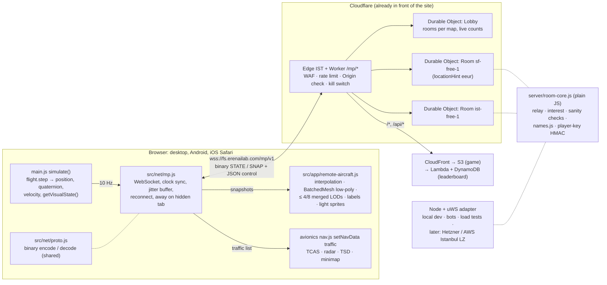
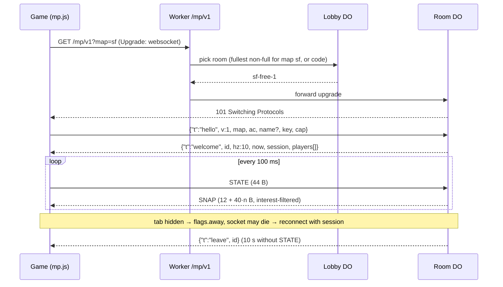

# Online mode: infrastructure readiness

Research only. No product code, cloud resource or setting was changed. Written 2026-09-27 for the question "How ready
is our infrastructure for online mode?" (see each other flying, later air combat, maybe paid).

Measurements in this document come from scratch scripts that are not committed: flight-model determinism, CPU cost,
dead-reckoning error, TCP RTT from Türkiye. Prices and third-party facts were read on 2026-09-26/27 and are linked
inline. Items marked *unverified* could not be confirmed from a primary source.

## Türkçe özet

- **Genel hazırlık: 5 üzerinden 2.**
  - İstemci tarafı beklenenden hazır: uçuş modeli DOM'dan bağımsız, Node'da çalışıyor ve aynı girdi ile aynı adım
    dizisinde bit bit aynı sonucu veriyor. Bir uçağın bir saniyelik simülasyonu 0,1–0,45 ms CPU tutuyor, yani
    sunucuda yüzlerce uçak koşturmak ucuz.
  - Sunucu tarafında gerçek zamanlı hiçbir şey yok: tek arka uç, istek/yanıt çalışan liderlik tablosu Lambda'sı.
- **Diğer uçakları çizmek** için gereken parçalar zaten var: `_lod.glb` modelleri, `props.glb` düşük poligonlu uçaklar,
  havalimanlarındaki `BatchedMesh` deseni ve TCAS/radar trafik girişi. Telefonda yaklaşık 5–25 ek çizim çağrısı
  yeterli. Uzak uçaklara ışık **eklenmemeli**, çünkü her ışık sayısı değişimi shader'ları yeniden derletip donma
  yaratıyor.
- **Gecikme** (Türkiye'den ölçüm): Milano 38–41 ms, Zürih 45–48 ms, Frankfurt 46–52 ms, Tel Aviv 76–82 ms,
  BAE 143–146 ms.
  - Körfez ve İsrail bölgeleri kötü seçim; trafik Avrupa üzerinden dolaşıyor.
  - Cloudflare'in İstanbul noktasına 7–9 ms'de ulaşılıyor, ama Durable Objects Türkiye'de çalışmıyor (en yakınları
    Frankfurt, Milano, Varşova ve Bükreş).
  - AWS'nin İstanbul Local Zone'u var. Ölçülmedi; Faz 3 için aday.
- **Aktarım: WebSocket** (iOS Safari dahil her yerde çalışıyor). WebTransport Safari 26.4 ile geldi, ama Cloudflare
  proxy'si ve Workers desteklemiyor. WebRTC ancak Faz 3'te gerekirse.
- **Faz 1 önerisi: Cloudflare Workers + Durable Objects**, oda başına bir nesne.
  - Maliyet: staging ve kapalı beta ücretsiz planda 0 $. Eşzamanlı 50 oyuncuda ~18 $/ay, 500'de ~140 $/ay,
    5.000'de ~1.400 $/ay.
  - AWS'de maliyeti bant genişliği belirliyor (0,09 $/GB): 500 oyuncuda ~600–860 $/ay. Hetzner o ölçekte çok ucuz
    (~10–100 €/ay), ama sunucuyu yönetmek gerekiyor.
  - Oda mantığı platformdan bağımsız düz JS olarak yazılırsa ileride taşımak kolay olur.
- **Hesaplar:** Faz 1–2'de gerekmiyor; anonim oyuncu anahtarı ve filtreli takma ad yeterli. Ücretli oyunda Google,
  Apple ve e-posta bağlantısı ile giriş önerilir. KVKK açısından gerekenler:
  - aydınlatma metni;
  - yurt dışı aktarım için standart sözleşme ve 5 iş günü içinde Kurum'a bildirim;
  - ihlallerde 72 saat içinde bildirim.
- **Yasal risk:** 7578 sayılı Kanun (1 Kasım 2026'da yürürlüğe giriyor) oyun platformlarına yaş derecelendirmesi,
  ebeveyn denetimi ve satın almada ebeveyn onayı getiriyor. Sohbet ya da ücretli özellikten önce avukata danışılmalı.
- **Moderasyon:** serbest sohbet yok. Hazır mesajlar, sessize alma/engelleme ve şikâyet olacak; aynı ada üç ayrı
  şikâyet gelirse ad otomatik gizlenir. Roblox ve Discord erişim yasakları bu yüzden önemli.
- **Yol haritası:**
  - Faz 1 "Hayaletler": birbirini görme, etkileşim yok; 2–3 hafta.
  - Faz 2 "Arkadaşlarla kol uçuşu": özel odalar, 20 Hz yakın katman, sunucuda puanlanan kol uçuşu görevi; 3–5 hafta.
  - Faz 3 "İt dalaşı": sunucu otoriteli silah, isabet ve hasar; 2–3 ay.
- **İlk kilometre taşı (M1):** staging'de hayalet beta.
  - Tek WebSocket üzerinden 10 Hz, 44 baytlık ikili durum mesajı; oda başına 64 oyuncu.
  - Gerçek uçuş modeliyle uçan Node botlarıyla yük testi.
  - Kapatma anahtarı ve Cloudflare kurallarının Cloudflare üzerinden testi.

## 0. Verdict at a glance

- **Readiness: 2 / 5.** The simulation, assets and instruments are ready for multiplayer. The infrastructure is not:
  nothing real-time exists. Full table in §7.
- **Phase 1 ("ghosts") is about 2–3 weeks away.**
  - Build: a WebSocket client, a remote-aircraft renderer built from existing LOD assets, and a Durable Object room
    relay.
  - Cost: $0 on Cloudflare's Free plan for staging and beta, about $18/month at 50 average concurrent players and
    about $140/month at 500.
  - Latency: 30–60 ms expected for most Turkish players.
- **Top 5 gaps:**
  1. No real-time backend.
  2. No remote-aircraft renderer or network client.
  3. Empty-sky risk: room design and player density.
  4. Moderation and minors under Turkish law.
  5. Nothing for combat or paid play.

## 1. Code readiness

### 1.1 Simulation, rendering and input are already separate

The flight models were written to run in Node: `src/flight/fixedwing.js` says "No DOM access: runs in Node", and the
test suites (`tests/fixedwing.test.mjs`, `tests/helicopter.test.mjs`) fly them there against fake worlds. The only
dependencies are three.js math classes (`Vector3`, `Quaternion`, `Euler`) and a small `world` interface.

The seams a network layer needs already exist in `src/app/main.js` (`simulate()`, lines 756–795):

| Seam | What crosses it | Network use |
|---|---|---|
| In: `InputState` | `{ pitch, roll, yaw, throttle, brake }` (5 numbers) plus discrete `flight.command(action)` calls (`gear`, `flapsDown`, `lights`, `emergency`, …) | Input upload (server authority, phase 3+) |
| Out: readable state | `position`, `quaternion`, `velocity`, `angularVelocity` and about 60 readouts (CONTRACTS-SF.md §6.3) | Snapshot source (phase 1–2) |
| Out: `getVisualState()` | control surfaces, flaps, slats, spoilers, speedbrake, gear, gear compression, engines (N1, afterburner, nozzle, reverser), rotor, canopy, lights | Drives remote aircraft animation |
| World: `step(dt, input, world)` | `getGroundHeight`, `isWater`, `isOnRunway`, `getObstacleHeight/Span`, `hitTest` | Server needs its own world for authority |

What is **not** ready:

- **One aircraft only.** `main.js` (895 lines) keeps one `state.flight` and one `state.rig`. Camera, HUD, audio,
  avionics and the frame pacer all assume it. Remote aircraft should be a separate module with a one-line hook in the loop.
  They should not be a second "player" threaded through everything.
- **No state save/restore.** The flight models keep a lot of internal state: FCS integrators, engine spool, autopilot
  modes, failures, the sub-step accumulator. None of it can be serialised. Server-side reconciliation (rewind and
  replay) needs `getState()` / `setState()`. That is an L-size job with a high regression risk in a heavily tested
  model.
- **The world is streamed around the camera.** Terrain heights (`terrain-heights.js`, Node-tested) and city obstacles
  (`city_obstacles.js`, an LRU of about 160 tiles of 1 km) are DOM-free binary data, but they load around the camera.
  A server would need them for the whole map. San Francisco's finest height level alone is 363 MB raw (`h/10.bin`,
  2 m grid). Coarser levels are 38–45 MB (L6–L8). City obstacles are 12 MB (SF) and 25 MB (İstanbul) compressed.
  That fits on a server, but it needs a map-wide loader.
- **No weapons, damage or health model.** The only thing close is the failure system (`src/flight/failures.js`:
  engine, fire, hydraulics, gear, tail rotor). Combat damage can reuse it (`failures.inject('fire', …)`).
- **Random failures** are seeded from `Date.now()` (`failures.js:159`). This only matters for server authority.
  They are off by default.

### 1.2 Determinism: measured

I ran a scratch experiment (not committed) in Node 26 on the real specs. It used a flat world and 20 s of scripted
stick inputs.

| Test | F-16 | A320neo | UH-60 |
|---|---|---|---|
| Same `(dt, input)` sequence twice, including jittery dt, SHA-256 of the Float64 state | **identical** | **identical** | **identical** |
| Same inputs, 60 Hz frames vs 20 Hz steps: position difference after 20 s | 9.8 m | 5.1 m | 9.1 m |
| Same inputs, 60 Hz vs jittery 30–120 Hz frames | 5.4 m | 2.8 m | 2.6 m |

The physics integrates at a fixed 1/240 s sub-step (`spec.substep`, `step()` accumulates frame dt). So for the same
engine and the same sequence of frame dts, the result is bit-identical. But some systems run once per **frame** with
the variable dt: `_frameSystems(dt)`, failures, the autopilot frame, nav and g-smoothing. And `main.js` passes the real
frame time, capped at 0.1 s. So the client and a server that tick at different rates drift apart by metres in about
20 s. Browsers add a second limit: JavaScript does not require `Math.sin`, `Math.exp` or `Math.pow` to give the same
last bit in V8 (Chrome/Node) and JavaScriptCore (Safari). That rules out lockstep between browsers.

Conclusions:

- **Lockstep or deterministic rollback is not an option.** It isn't needed either: flight sims replicate state, not
  inputs.
- **Server-side prediction for anti-cheat works** as long as it tolerates metre-level drift over seconds. Re-anchor
  the server's shadow model to the client's reported state every snapshot and compare only short horizons (0.5–2 s).
- For full server authority with client prediction (phase 3b), the client would have to step the model in fixed ticks
  (for example 60 Hz sim ticks decoupled from rendering) and the model would need `getState/setState`.

### 1.3 Could the model run in a server or worker? Yes, cheaply

CPU cost measured in the same experiment: 50 aircraft of each type at 20 Hz server ticks, 30 simulated seconds, flat
world, Apple M4 Max, single thread.

| Aircraft | CPU ms per aircraft per simulated second | Aircraft per core in real time |
|---|---|---|
| F-16 | 0.23 | ≈ 4,300 |
| F-22 | 0.28 | ≈ 3,500 |
| A320neo | 0.45 | ≈ 2,200 |
| 737-800 | 0.26 | ≈ 3,800 |
| UH-60 | 0.11 | ≈ 8,800 |

Allow for a cloud vCPU (2–3× slower than an M4 core), real terrain and obstacle lookups, and GC. Even then, one vCPU
runs the full flight model for several hundred aircraft. **CPU is not the constraint for server authority. Model
state, world data and reconciliation are.** It also means a Cloudflare Durable Object (V8) or a Node worker thread
could run "shadow" models for validation.

### 1.4 Snapshot contents and size

Minimum state per aircraft per tick, quantized. Maps are at most 64 × 60 km (İstanbul, CONTRACTS-IST.md §1), so
millimetre integers fit in 32 bits.

| Field | Encoding | Bytes |
|---|---|---|
| entity id | u16 | 2 |
| flags (crashed, on ground, paused/away, reset, quaternion index) | u8 | 1 |
| position x, y, z | i32 × 3, millimetres | 12 |
| orientation | "smallest three" quaternion, i16 × 3 (≈ 0.003° steps) | 6 |
| velocity | i16 × 3, 1/40 m/s (±819 m/s: covers Mach 2) | 6 |
| angular velocity (body) | i8 × 3, 1/16 rad/s (±8 rad/s: the F-16's 310°/s roll) | 3 |
| aileron, elevator, rudder | i8 × 3 | 3 |
| throttle lever, N1 or rotor RPM, gear, flaps, speedbrake/spoilers | u8 × 5 | 5 |
| lights (nav, strobe, beacon, landing, taxi), afterburner, reverser, canopy | bit field u8 | 1 |
| age of this player's last update (4 ms units) | u8 | 1 |
| **Total** | | **40 B** |

Phase 3 adds about 4 B: health u8, damage bits u8 (engine, fire, hydraulic, gear, which map to `failures`), and a
weapon state u16. That comes to about 44 B. Delta or "changed fields only" encoding could get to 20–25 B, but it
isn't worth the complexity before phase 3.

Per-player metadata (nickname, aircraft id, livery colour index) goes out once on join, not in every snapshot.

**Bandwidth per player** (downlink; 12 B snapshot header; overhead of about 78 B per packet for WebSocket, TLS 1.3
and TCP/IP):

| Snapshot rate | Visible aircraft (K) | Downlink | Per hour | Per player-month at 24/7 (GB) |
|---|---|---|---|---|
| 10 Hz | 8 | 4.1 kB/s (33 kbit/s) | 15 MB | 10.6 |
| 10 Hz | 15 | 6.9 kB/s (55 kbit/s) | 25 MB | 17.9 |
| 10 Hz | 24 | 10.5 kB/s (84 kbit/s) | 38 MB | 27.2 |
| 20 Hz | 15 | 13.8 kB/s (110 kbit/s) | 50 MB | 35.8 |
| 20 Hz | 24 | 21.0 kB/s (168 kbit/s) | 76 MB | 54.4 |

The uplink is 1.2 kB/s at 10 Hz (44 B state plus overhead). For comparison, the game already streams 6–12 MB of
assets **per minute** on a phone (docs/perf/findings-2026-09.md). Multiplayer adds 25–50 MB per **hour**, which is
small next to that and matters on Turkish mobile data plans.

### 1.5 Rendering other aircraft

Three levels of detail already exist as assets, and a batching pattern exists in code:

| Tier | Asset | Triangles | Draws | Where it is used today |
|---|---|---|---|---|
| Full | `assets/aircraft/<id>/<id>.glb` | 75k–213k | 59–141 | player aircraft |
| LOD | `<id>_lod.glb` (0.4–0.6 MB) | 30k–40k | 11–93 (merged: 1–3) | LOD-first start; the "agent LOD" of parked aircraft near the camera (`airports_props.js`) |
| Low-poly | `props.glb` nodes `airliner_narrow`, `fighter_f16`, `fighter_f22`, `heli_uh60` | 564–2,886 | 1 BatchedMesh per airport | parked aircraft |

`airports_props.js` already merges an aircraft's untextured LOD materials into one vertex-coloured part (a few draws
per aircraft). It draws every parked aircraft of an airport with **one `BatchedMesh`** that has per-instance livery
colour and visibility, and it keeps a near-triangle budget (`NEAR_TRI_BUDGET = 0.7e6`). Remote aircraft should reuse
this pattern:

- **Beyond 8 km:** no mesh. Show a dot or chevron plus the nickname on the HUD canvas, and the aircraft on the
  minimap and TCAS/radar.
- **1–8 km:** one `BatchedMesh` for all remote aircraft, using the `props.glb` low-poly types. That is 1 draw call and
  about 2k triangles each.
- **Under ~1 km, nearest 4 (phone) / 8 (desktop):** the merged `_lod.glb` (3–5 draws, about 36k triangles). On
  desktop, add animated gear and control surfaces by grafting onto the skeleton (`aircraft-lod.js`) only for aircraft
  in formation range.

Budget: phones run at 170–252 draw calls, and a 6× CPU-throttled phone is already 97 % busy on the main thread
(docs/perf/findings-2026-09.md). The plan above adds about 5–25 draws and at most about 0.3 M triangles.

Traps specific to this codebase:

- **No lights on remote aircraft.** three.js recompiles every lit shader when the light count changes, which causes
  multi-second freezes in WebKit (`keepLightCount` in main.js; perf P8). Use emissive sprites for nav, strobe and
  landing lights instead.
- **The frame pacer** drops to "parked" rates when *our* aircraft doesn't move (`paceMode`, `noteMotion`). Remote
  motion within view must count as motion.
- **Hidden tabs** stop `requestAnimationFrame`, so the simulation stops too. iOS also suspends or kills sockets in the
  background. The server must time out silent players (about 10 s) and the client must reconnect on `visibilitychange`.
- **GPU-failure reloads** (`gpu-resume.js`) reload the page mid-flight. The reconnect must rejoin the same room and
  identity (session token in `sessionStorage`).
- **Synthetic traffic** (`src/avionics/nav.js` `traffic(t)`) already feeds TCAS, radar and TSD on all five cockpits,
  and `setNavData({ traffic })` can replace it. Real players can show up on the instruments with almost no avionics
  work.

## 2. Netcode design for a flight simulator

### 2.1 Authority model

| Model | How it works | Pros | Cons | Fit |
|---|---|---|---|---|
| **Client-authoritative + relay + sanity checks** | Each client simulates its own aircraft and sends state at 10–20 Hz. The server relays with interest management and rejects impossible states. | Zero input lag and the flight model stays in the browser. Server CPU is trivial and the server has no world data. Works with 100–200 ms RTT. | Positions can be cheated: teleports, speed hacks, "god mode". | **Phases 1–2** (no scoring between players) |
| **Hybrid: client-authoritative movement, server-authoritative combat** | As above, and the server also owns weapons, hits, damage, ammo and kills. It runs a "shadow" flight model per aircraft, re-anchored each snapshot, to flag movement outside the aircraft's envelope. | Cheats that matter (damage, infinite ammo, aimbots through damage) are blocked. No client rewind/replay needed. | Movement hacks are detected, not prevented. Kick or ban after the fact. | **Phase 3** (casual/free dogfights) |
| **Full server authority** | Clients send inputs. The server steps every flight model. Clients predict and reconcile (rewind and replay). | Strongest anti-cheat and needed for ranked/paid competition. | Needs `getState/setState`, fixed sim ticks on the client and the world on the server. At 150 m/s a 1-tick misprediction is metres. | Phase 3b, only if ranked/paid PvP happens |

Local control stays on the client in every option. Aircraft have high momentum, so other aircraft tolerate latency
well (§2.2). The player's own controls do not.

### 2.2 Snapshot interpolation and dead reckoning

Measured dead-reckoning error for the F-16 flying a scripted dogfight (full-stick reversals, up to 7.6 g, about
196 m/s), from the same experiment:

| Extrapolation horizon | Linear (p + v·t) max error | Quadratic (+ ½·a·t²) max error | Attitude change in that time |
|---|---|---|---|
| 100 ms | 0.4 m | 0.1 m | up to 32° |
| 200 ms | 1.5 m | 0.5 m | up to 64° |
| 350 ms | 4.5 m | 2.4 m | up to 112° |
| 500 ms | 9.2 m | 6.1 m | up to 160° |

Position extrapolates very well. Attitude does not, because fighters roll at up to 300°/s. So:

- **Far aircraft (> ~1 km): interpolation.** Render remote aircraft about 150 ms (20 Hz) or 250 ms (10 Hz) in the
  past, between two real snapshots. Use cubic Hermite on position (positions and velocities are both in the snapshot)
  and slerp on orientation. There are no visible errors, and packet loss is covered by extrapolating for up to 0.5 s,
  then freezing and fading out.
- **Near aircraft (formation, gun range): extrapolate to "now".** At 150 m/s, 250 ms in the past means 37 m behind.
  Formation flying at 10–20 m spacing is impossible against a delayed image. Predict to the present with quadratic
  position plus angular-velocity rotation. The horizon is the other player's one-way delay through the server
  (about half of each player's RTT) plus the age of the last snapshot. With a Frankfurt-class region and 20 Hz that
  is about 40–100 ms, where the table shows 0.1–0.4 m error. Blend corrections over 100–200 ms ("convergence")
  instead of snapping.
- **Flight-model extrapolation** (run a local model of the remote aircraft with its last known controls) is the
  next step up. The model is cheap and control positions are in the snapshot, but it needs `setState`. Keep it for
  phase 3.

### 2.3 Tick rate

- **Phase 1:** 10 Hz up and 10 Hz down. Interpolation hides the rate and it halves bandwidth.
- **Phase 2:** 20 Hz for aircraft within ~2 km (formation), 10 Hz for the rest.
- **Phase 3:** 20 Hz simulation and snapshots in dogfight rooms (≤ 16 players). 30 Hz only if tests show gun hits
  feel unfair.

### 2.4 Interest management

The server keeps a 2 km spatial hash per room. Each tick it builds each client's list:

| Tier | Range | Rate | Content |
|---|---|---|---|
| Near | < 2 km | every tick | full record |
| Mid | 2–10 km | every 2nd tick | full record |
| Far | 10–40 km | 1 Hz | full record, for minimap, TCAS and radar |

The list is capped at K nearest: 12 on phones, 24 on desktop. The client sends its cap in `hello`. At 64 players per
room the fan-out is 64 × K records per tick, which is trivial.

### 2.5 Rooms and shards

- **A room is a map plus a mode.** Room types are `sf-free`, `ist-free`, private friend rooms and dogfight arenas.
  Public rooms hold up to 64 players. A new player joins the **fullest non-full** public room of the map, so players
  actually meet. With 50 players spread over two maps and a dozen airports, an "empty sky" is the biggest UX risk.
- **Spawn near people.** In online mode, offer "Oyunculara katıl" (spawn behind a random player, airborne) in
  addition to the airport starts.
- **Private rooms:** 6-character code plus a share link `?room=ABC123` (the existing share UI can carry it).
- **One region.** About 80 % of players are in Türkiye, so every room lives in one region close to Türkiye (see §3).
  Regional shards only become worth it with a large non-Turkish audience.

### 2.6 Combat (phase 3)

- **Guns:** the shooter's client sends `fire` (tick, muzzle pose, aim) and its own hit claims. The server simulates
  projectiles (about 1,000 m/s, 0.3–1 s time of flight). It checks hits against targets **rewound** by the shooter's
  latency plus interpolation delay (Valve-style lag compensation), within a tolerance, capped at about 200 ms of
  rewind. Rate of fire and ammunition are enforced on the server.
- **Missiles:** these are server-owned entities, simulated and replicated like aircraft (seeker, proportional
  navigation, motor burn). No lag compensation is needed: the target client evades a missile it sees at its true
  position. Flares and chaff are server-side random draws.
- **Damage:** the server decides and maps damage to the existing failures (`engine`, `fire`, `hydraulic`, `gear`)
  plus a new structural health value. It sends damage as reliable events. The client applies them with
  `failures.inject`.
- **Anti-cheat basics:**
  - Per-type envelopes from `spec.js`: max TAS, max g, climb rate, ceiling.
  - Teleport detection: position against velocity integration.
  - Ground and obstacle checks at a coarse terrain level.
  - A shadow flight model re-anchored every snapshot.
  - Server-side cooldowns.
  - The client never decides damage.
  - Replays of flagged fights kept for about 7 days.
  - An obfuscated but public client (the repository is open source) means security by obscurity is worth nothing.
    Everything that matters must be decided on the server.

## 3. Transport and hosting for players in Türkiye

### 3.1 Latency from Türkiye

**Our own measurement.** One residential connection in Türkiye, measured 2026-09-27 around 00:50 TRT. The value is
the TCP connect time (≈ 1 RTT; DNS excluded), median of 7, generic User-Agent, and only public health endpoints were
used: AWS `dynamodb.<region>.amazonaws.com/ping` (the method [CloudPing](https://www.cloudping.info/) uses),
Cloudflare `speed.cloudflare.com/cdn-cgi/trace`, and Hetzner's public speed-test hosts.

| Target | Median RTT | Notes |
|---|---|---|
| Cloudflare edge | **6.6 ms** | the trace reported `colo=IST`: this ISP reaches Cloudflare's Istanbul PoP |
| AWS eu-south-1 (Milan) | **37.9 ms** | fastest AWS region from here |
| AWS eu-central-2 (Zurich) | 45.2 ms | |
| AWS eu-central-1 (Frankfurt) | 45.8 ms | where the leaderboard already runs |
| Hetzner Falkenstein / Nuremberg | 53.2 / 53.3 ms | |
| AWS eu-south-2 (Spain) | 63.5 ms | |
| AWS eu-west-1 (Ireland) | 65.1 ms | |
| Hetzner Helsinki | 75.3 ms | |
| AWS il-central-1 (Tel Aviv) | 76.1 ms | geographically close, but routed through Europe |
| AWS ap-south-1 (Mumbai) | 138.3 ms | |
| AWS me-central-1 (UAE) | **142.9 ms** | routed through Europe; the worst option despite the map |
| AWS me-south-1 (Bahrain) | n/a | opt-in region, endpoint not reachable |

A second run from the same line by the research sub-agent the same night gave the same order: Milan 40.7,
Zurich 47.8, Frankfurt 52.0, Tel Aviv 81.8, UAE 145.9 ms, Cloudflare 9.2 ms (IST), CloudFront 11.5 ms (IST50 edge).
This is one ISP. Other ISPs route differently.

**Published data between datacentres** ([WonderNetwork](https://wondernetwork.com/pings/Istanbul/Frankfurt), median of
hourly averages, 12–26 Sep 2026; swap the city names in the URL for the other pairs):

| From | Frankfurt | Falkenstein | Zurich | Milan | Helsinki | Tel Aviv | Manama | Dubai |
|---|---|---|---|---|---|---|---|---|
| Istanbul | 28.9 | 28.8 | 29.9 | 45.2 | 41.8 | 76.2 | 116.8 | 213.4 |
| Ankara | 45.3 | 47.6 | 49.1 | 61.2 | 75.7 | 91.5 | 142.8 | 168.0 |
| İzmir | 44.4 | 45.7 | 47.7 | 51.9 | 71.5 | 92.1 | 166.7 | 173.0 |

**Cloudflare reachability per ISP.** [RIPE Atlas](https://atlas.ripe.net/measurements/176906978/) built-in pings from
67 Turkish probes, latest results 2026-09-26, median min-RTT to cloudflare.com vs CloudFront
([measurement](https://atlas.ripe.net/measurements/177401165/)):

| ISP | Cloudflare | CloudFront |
|---|---|---|
| Türk Telekom (AS9121, 12 probes) | 13.5 ms | 25.2 ms |
| Turkcell Superonline (AS34984, 8) | **51.8 ms** (served from abroad) | 13.6 ms |
| TurkNet (6) | 10.4 ms | 15.1 ms |
| Türksat (6) | 8.3 ms | 11.6 ms |

The old worry about Türk Telekom and Cloudflare does not show up today: RIPE's BGP data shows a
[direct TT–Cloudflare adjacency](https://stat.ripe.net/data/asn-neighbours/data.json?resource=AS9121). The outlier is
Superonline, about +40 ms to Cloudflare. I could not verify the history of the dispute.

**What this means**

- **Every realistic option lands at 30–60 ms RTT for most players.** That covers AWS Frankfurt, Milan or Zurich,
  Hetzner Germany, and Cloudflare Durable Objects. It is plenty for phases 1–2, where interpolation hides 100–250 ms,
  and acceptable for phase 3 with lag compensation.
- **Skip the Gulf and Israel regions.**
  - me-central-1 (143–146 ms) and me-south-1 (unreachable) route through Europe. The AWS status feeds for both still
    list an open multi-service disruption: events opened 1–2 Mar 2026, last update 15 Sep 2026
    ([me-central-1](https://status.aws.amazon.com/rss/ec2-me-central-1.rss),
    [me-south-1](https://status.aws.amazon.com/rss/ec2-me-south-1.rss)).
  - il-central-1 (76–82 ms) is slower than Frankfurt and has more expensive egress.
- **AWS has an Istanbul Local Zone** (`eu-central-1-ist-1a`, parent Frankfurt; generally available;
  [locations](https://aws.amazon.com/about-aws/global-infrastructure/localzones/locations/),
  [features](https://aws.amazon.com/about-aws/global-infrastructure/localzones/features/)).
  - Only C7i, M7i and R7i instances are available (c7i.large $0.107/h), plus EBS, ALB and ECS/EKS on EC2.
  - There is no Fargate, NAT Gateway or GameLift.
  - Egress costs $0.09/GB.
  - For Istanbul players this is the only option that could reach about 10 ms. **I did not measure it**: there is no
    public endpoint. It is the candidate to test for phase 3 dogfights, not something to pay for in phase 1.
- **Cloudflare Durable Objects cannot run in Türkiye.** Only about 11 % of Cloudflare locations host Durable Objects,
  and IST and ADB are not among them ([where.durableobjects.live](https://where.durableobjects.live), 2026-09-26).
  - The `eeur` [location hint](https://developers.cloudflare.com/durable-objects/reference/data-location/) places
    objects in Frankfurt 22 %, Milan 22 %, Warsaw 18 %, Stockholm 10 %, Bucharest 10 %, Vienna 9 % and Prague 9 %.
  - A Turkish player reaches the IST edge in about 7–14 ms and then crosses Cloudflare's backbone to one of those
    cities. The expected total is 30–60 ms, comparable to AWS Frankfurt (not measured).
  - A room object stays where it was created. Give each room the `eeur` hint and recreate it if it lands badly.

### 3.2 Browser transports (and iOS Safari)

| Transport | Browser support (2026) | Pros | Cons | Verdict |
|---|---|---|---|---|
| **WebSocket** (`wss://`) | about 97 % ([caniuse](https://caniuse.com/websockets)), every iOS version we support | Simple and passes through Cloudflare's proxy on every plan ([docs](https://developers.cloudflare.com/network/websockets/)). Same origin, so no CORS, and the current CSP needs no change (`object-src 'none'; base-uri 'self'; frame-ancestors 'none'`: no `connect-src`). Workers and Durable Objects speak it natively. | TCP head-of-line blocking: one lost packet delays later snapshots by about 1 RTT. | **Use for phases 1–3.** A 100–250 ms interpolation buffer absorbs the stalls. |
| **WebRTC data channel** (unordered, `maxRetransmits: 0`) | Safari has supported unreliable channels since 11 ([MDN BCD](https://github.com/mdn/browser-compat-data/blob/main/api/RTCDataChannel.json)) | UDP-like: no head-of-line blocking. | Needs signalling, ICE/STUN, a UDP port range on the server (geckos.io, node-datachannel, Pion) or Cloudflare Realtime ($0.05/GB after 1 TB free; DataChannels unordered since 2026-08-13, [changelog](https://developers.cloudflare.com/changelog/post/2026-08-13-datachannels-reliability-ordering/)). TURN is needed where UDP is blocked; old data says 10–22 % of peer-to-peer sessions ([source](https://stackoverflow.com/questions/67615719)). Most Turkish mobile users are on IPv4, probably behind CGNAT ([APNIC IPv6 by AS](https://stats.labs.apnic.net/ipv6/TR)). | Phase 3 upgrade path only, with WebSocket as fallback |
| **WebTransport** (HTTP/3 datagrams) | Chrome 97+, Firefox 114+, **Safari/iOS 26.4+** ([WebKit, March 2026](https://webkit.org/blog/17862/webkit-features-for-safari-26-4/)); about 91 % ([caniuse](https://caniuse.com/webtransport)); an Interop 2026 focus area | Unreliable datagrams with a WebSocket-like API. | **Can't pass through Cloudflare's proxy**: no HTTP/3 to origin ([docs](https://developers.cloudflare.com/speed/optimization/protocol/http3/)), and Workers don't support it ([workerd #6454](https://github.com/cloudflare/workerd/discussions/6454)). A DNS-only host would expose the server IP, against the intentional proxy decision. iOS < 26.4 needs a fallback. Node server support is thin (`@fails-components/webtransport`); Go has `webtransport-go`. | Reconsider in 2027 for phase 3 |

**iOS Safari specifics** (about a third of players are on phones):

- WebSockets work, but a backgrounded tab is suspended and its socket dies. On `visibilitychange`, send `away`, and
  reconnect with the session token when the tab is visible again.
- In-app browsers (X, Instagram) are already detected (`src/ui/touch-env.js`). WebSockets work in them too.
- Do not use WebRTC for phases 1–2. It adds ICE/TURN failure modes on CGNAT mobile networks for no visible gain at
  10 Hz.

### 3.3 Hosting options

| Option | Latency from Türkiye | Ops for a solo owner | Fit |
|---|---|---|---|
| **Cloudflare Workers + Durable Objects** (one object per room; `partyserver`, the successor of [PartyKit](https://blog.cloudflare.com/cloudflare-acquires-partykit/), is optional sugar) | Edge IST 7–14 ms, then Cloudflare's backbone to an `eeur` object location (FRA/MXP/WAW/OTP/VIE…): 30–60 ms expected, not measured. Superonline users reach the edge at about 52 ms. | No servers, no TLS, no patching, scales to zero. Already our CDN/WAF, so no new processor. A code deploy disconnects every socket, so clients must reconnect (they must anyway). | **Phases 1–2** |
| **Node + uWebSockets.js on AWS** (Lightsail or EC2, eu-central-1; the Istanbul Local Zone for phase 3) | Frankfurt 46–52 ms, Milan 38–41 ms, Istanbul LZ about 10 ms? (unmeasured) | One server to run. Same account and region as the leaderboard. Egress $0.09/GB. | Phase 3 if the Local Zone test is convincing |
| **Node + uWS (or Colyseus) on Hetzner** FSN/NBG | 53–56 ms | One server to run. New vendor and processor. 20 TB/month included. | Phase 3 / scale > 1,000 CCU |
| **Photon Realtime / Fusion** (managed) | **Istanbul region "tr"** ([regions](https://doc.photonengine.com/realtime/current/connection-and-authentication/regions)): the only turnkey option hosted in Türkiye | Zero ops. JS SDK over WSS. But proprietary, the SDK is behind a login (check its licence against our Apache-2.0 public repo), server logic needs paid plugins, CCU plus traffic pricing. | Alternative for phases 1–2 if latency or ops matter more than lock-in |
| API Gateway WebSocket + Lambda | Frankfurt | per-message billing, 2 h connection limit, no tick loop | Rejected (§4) |
| GameLift Servers / Realtime | Frankfurt (no Istanbul) | Realtime's client SDK is C# over raw TCP/UDP ([docs](https://docs.aws.amazon.com/gameliftservers/latest/realtimeguide/realtime-client.html)), so no browser client | Rejected for now |

**Ready-made frameworks**

| Framework | Licence | Cost | Notes |
|---|---|---|---|
| [Colyseus](https://colyseus.io/pricing/) | MIT | self-host free; Colyseus Cloud from $15/month, "unlimited bandwidth", no CCU limit (regions near Türkiye unverified) | Rooms, matchmaking, reconnection, delta state sync, docs on prediction and lag compensation. A good base if phase 3 moves to Node. |
| [Nakama](https://heroiclabs.com/pricing/) | Apache-2.0 | self-host (Go + Postgres) or Heroic Cloud from about $600/month | Accounts, friends, chat, wallet, matchmaking. Only worth it if all of that is wanted at once. |
| [Photon](https://www.photonengine.com/pricing) | proprietary | 20 CCU free; 100 CCU $95 once per 12 months; 500 CCU $95/month; 1,000 CCU $185/month; traffic overage in "tr" $0.10/GB | If about 3 GB/CCU is included (60 GB for 20 CCU on the free plan suggests so), our 18 GB/CCU-month adds about $1.50 per CCU in overage. That is an inference, not verified. |
| [Edgegap](https://edgegap.com/pricing) | proprietary | $0.00115 per vCPU-minute + $0.10/GB | Container orchestration at 600+ edge locations. Egress is expensive for us. |
| Hathora | – | – | Wound down its game hosting in 2026 and moved customers to [Nitrado GameFabric](https://gamefabric.com/blog/nitrado-and-hathora-collaborate-on-customer-transition-to-gamefabric) |
| Socket.IO | MIT | self-host | Adds framing overhead and long-polling. Not needed. |

### 3.4 Recommendation

- **Phases 1–2: Cloudflare Workers + Durable Objects over WebSocket**, on the existing `fs.erenailab.com` zone.
  - Staging and a closed beta fit the **Free plan**. Production needs Workers Paid ($5/month), about $18 at 50 CCU.
  - Keep the room logic a **plain JS module with no Cloudflare APIs** (`server/room-core.js`: relay, interest,
    checks). Wrap it in a thin Durable Object adapter and a thin Node/uWS adapter. The Node adapter serves local dev,
    bots and load tests.
  - With that split, moving to Hetzner, AWS or the Istanbul Local Zone is a deploy change, not a rewrite.
- **Before phase 3:** measure real RTT from players to Durable Objects (the client can report its measured RTT in
  telemetry), to AWS Frankfurt/Milan and to the Istanbul Local Zone. Move dogfight rooms to Node in the best of them
  if Durable Objects are much slower. The Local Zone is the only AWS option that could give Istanbul players about
  10 ms.
- **Cloudflare checklist:**
  - A Worker route for `fs.erenailab.com/mp/*`.
  - Confirm the managed challenge (on `/` only), the "block write methods" rule and the rate-limit rule leave WebSocket
    upgrades to `/mp/*` alone. Test **through Cloudflare**, not only against the origin: the lesson of the 2026-09-24
    leaderboard outage.
  - Staging is DNS-only with an IP allow-list, so a Worker route can't attach there. Use a proxied
    `mp-staging.erenailab.com` Workers custom domain with its own IP rule, and check `Origin` in the Worker.

## 4. Costs

### 4.1 Assumptions

- The figures are **average** concurrent players (CCU) held for a whole month, which is an upper bound. 50 CCU on
  average is 36,000 player-hours a month. If the numbers are evening **peaks**, usage-priced lines (Durable Objects,
  egress) are about ⅓ of these; fixed servers are not.
- The traffic model is §1.4: 15 visible aircraft on average, 40 B records, and about 78 B of overhead per packet.
  - At 10 Hz that is 6.9 kB/s down and 1.2 kB/s up per player, or 17.9 GB of egress per CCU-month.
  - At 20 Hz it is 35.8 GB per CCU-month.
- Room size is 48 players on average (64 max) at 10 Hz and 40 at 20 Hz. The 40 comes from the 1,000 req/s soft limit
  per Durable Object: at 20 Hz, 48 players would already send 960 messages/s.
- Prices were seen on 2026-09-26/27 and exclude VAT. Sources:
  - [Durable Objects pricing](https://developers.cloudflare.com/durable-objects/platform/pricing/), [Workers pricing](https://developers.cloudflare.com/workers/platform/pricing/)
  - AWS public price-list API (`pricing.us-east-1.amazonaws.com/offers/v1.0/aws/<Service>/current/<region>/index.json`), [EC2 data transfer](https://aws.amazon.com/ec2/pricing/on-demand/), [Lightsail](https://aws.amazon.com/lightsail/pricing/)
  - [Hetzner price feed](https://www.hetzner.com/_resources/app/data/app/live_data_prices.json), [Hetzner cloud](https://www.hetzner.com/european-cloud/)

### 4.2 Monthly estimate (USD; Hetzner in EUR)

| Average CCU | Egress / month | **Cloudflare Workers + Durable Objects** | **AWS eu-central-1** (EC2 c7g or Lightsail, Node/uWS) | **Hetzner** FSN/NBG (Node/uWS) |
|---|---|---|---|---|
| 50 @ 10 Hz | 0.9 TB | **≈ $18** ($5 plan + 64 M billed requests + 2 rooms' duration) | **≈ $12** (Lightsail $12 bundle, 3 TB included) or ≈ $105 on EC2 (egress $72) | **≈ €7–9** (one CX23/CX33, 20 TB included) |
| 500 @ 10 Hz | 8.9 TB | **≈ $140** (648 M requests ≈ $97, 11 rooms ≈ $40) | ≈ $610 (Lightsail $24 + 6.5 TB overage) / ≈ $860 (EC2 + $0.09/GB) | ≈ €20 (two servers for redundancy) |
| 5,000 @ 10 Hz | 89 TB | ≈ $1,400 | ≈ $7,300 (egress ≈ $7,050) | ≈ €50–100 (5 servers, 20 TB each, plus LB) |
| 50 @ 20 Hz | 1.8 TB | ≈ $27 | ≈ $12 (Lightsail) | ≈ €7–9 |
| 500 @ 20 Hz | 17.9 TB | ≈ $250 | ≈ $1,600 | ≈ €20–30 |
| 5,000 @ 20 Hz | 179 TB | ≈ $2,450 | ≈ $13,000 | ≈ €90–200 (9+ servers, or overage) |

How to read it:

- **Egress decides the bill, not CPU.** One small server can relay 500–2,000 players, since the relay does almost no
  decoding (§8.3) and even full physics costs < 0.5 ms per aircraft-second (§1.3).
- **AWS is the most expensive option at any real scale** because of $0.09/GB egress. il-central-1 and me-central-1
  cost $0.11/GB. The Istanbul Local Zone is also $0.09/GB, with c7i.large at $0.107/h. The exception worth checking
  before phase 3: the [GameLift Servers pricing page](https://aws.amazon.com/gamelift/servers/pricing/) now
  advertises free network bandwidth on newer instance generations (c7g.large $0.107/h in Frankfurt). But GameLift has
  no browser SDK, and WSS needs a certificate per fleet. I have not verified this.
- **Cloudflare** has no egress charges at all, and outgoing WebSocket messages and protocol pings are free. You pay
  for **incoming** messages (20 messages bill as 1 request, $0.15/M after 1 M) plus room duration (128 MB ×
  wall-clock time while awake, $12.50/M GB-s after 400k).
  - An always-awake room costs about $4/month; each player at 10 Hz about $0.19/month.
  - The **Free plan** includes SQLite-backed Durable Objects: 100k requests/day (= 2 M WebSocket messages, about 55
    player-hours at 10 Hz) and 13,000 GB-s/day. Enough for staging and a closed beta at **$0**.
- **Hetzner** is 10–100× cheaper at scale (20 TB of traffic included per server in the EU). It is also a new vendor
  and account and a new processor under KVKK/GDPR, and the owner would run a server: patching, TLS, monitoring and a
  single point of failure. The prices in its live feed are higher than the 2024–25 lists; confirm at checkout.
- **Rejected: API Gateway WebSocket + Lambda.** Every message in either direction is billed ($1.14/M in Frankfurt),
  and every incoming message also runs a Lambda. There is no tick loop to batch snapshots in, and connections last at
  most 2 hours ([limits](https://docs.aws.amazon.com/apigateway/latest/developerguide/apigateway-execution-service-websocket-limits-table.html)).
  Even with one batched snapshot per client per tick, 50 CCU at 10 Hz is about 2.6 billion messages: roughly
  $2,700/month plus about 1.3 billion Lambda invocations.

For scale: today's AWS bill (S3, CloudFront, a Lambda with reserved concurrency 10, DynamoDB on demand) is small, and
Cloudflare is on a free or low plan. Phase 1 on Durable Objects adds $0 (Free plan) to about $20 a month until
concurrency reaches the hundreds.

## 5. Accounts and identity

### 5.1 Phases 1–2: no accounts

The anonymous identity that already exists is enough:

- The `gokyuzu.player` key (localStorage) is sent in `hello`. The server keeps only an HMAC of it, the same pattern as
  the leaderboard Lambda. That HMAC is the handle for mute, report and ban.
- A short-lived signed session token in `sessionStorage` lets a player rejoin after a reload or a GPU-failure resume.
- Nicknames stay optional and filtered by `names.js`. Private rooms work with a code or link. Nothing new is stored
  about the person.
- The room server still sees IP addresses, which are personal data under KVKK and GDPR. Do not log them. Rate-limit
  on a salted, rotating hash as `infra/leaderboard/lambda/net.mjs` does. Add online play to the "Gizlilik"
  paragraph in the menu (`src/ui/panels.js`). It currently says "kişisel bilgi toplanmaz", which must stay true or be
  reworded.

### 5.2 Paid, ranked or cross-device progress: accounts

| Method | Cost | Notes |
|---|---|---|
| **Google** (Identity Services) | free ([docs](https://developers.google.com/identity/gsi/web/guides/overview)) | Most Android users are already signed in. |
| **Apple** | Apple Developer Program, $99/year ([enroll](https://developer.apple.com/programs/enroll/)) | Important for the iOS share. Players may use a private relay email. |
| **Email magic link** | Amazon SES $0.10 per 1,000 ([pricing](https://aws.amazon.com/ses/pricing/)); Cloudflare Email Service 3,000/month included on Workers Paid ([pricing](https://developers.cloudflare.com/email-service/platform/pricing/)) | Fallback for everyone else. |
| **Passkeys** | free | About 94 % support, iOS 16+. Add later as "remember this device". |
| Sign in with X | The X API is pay-per-use ([pricing](https://docs.x.com/x-api/getting-started/pricing)); the per-login cost is unverified, possibly about $0.01 | Not worth it, although player feedback arrives on X. |

**Managed identity providers** (free tier in MAU):

- [Cognito](https://aws.amazon.com/cognito/pricing/): 10k. Same AWS account and region.
- [Firebase Auth](https://firebase.google.com/pricing): 50k.
- [Supabase](https://supabase.com/pricing): 50k.
- [Clerk](https://clerk.com/pricing): 50k retained.
- [Auth0](https://auth0.com/pricing): 25k.

A lighter alternative is verifying Google and Apple ID tokens (JWKS) directly in the Worker or Lambda and storing
`{ provider, hashed subject, nickname, created }`. That adds no new processor.

### 5.3 Data protection when accounts exist

**KVKK (Law 6698)** ([text](https://www.mevzuat.gov.tr/MevzuatMetin/1.5.6698.pdf)):

- **Aydınlatma metni** (privacy notice, Art. 10).
- Legal basis: "necessary for the contract" (Art. 5(2)(c)) for the account. Explicit consent (açık rıza) only for
  optional processing such as marketing email.
- Answer data-subject requests within 30 days, free of charge.
- Delete or anonymise data when its purpose ends
  ([guide](https://www.kvkk.gov.tr/Icerik/2038/kisisel-verilerin-silinmesi-yok-edilmesi-veya-anonim-hale-getirilmesi)).
- Notify breaches to the Board within **72 hours** ([decision 2019/10](https://www.kvkk.gov.tr/Icerik/5362/Veri-Ihlali-Bildirimi)).
- **VERBİS**: exempt below 50 employees and 100 M TL annual balance sheet (Board decision 2023/1154), unless the main
  activity is processing special-category data ([FAQ](https://verbis.kvkk.gov.tr/sharedFolder/sorularla-verbis.pdf)).
- **Cross-border transfer (Art. 9, rewritten by Law 7499, in force 1 June 2024).** AWS Frankfurt and Cloudflare are
  abroad. The route is the Board's **standard contract**
  ([texts](https://standartsozlesme.kvkk.gov.tr), [guide](https://www.kvkk.gov.tr/Icerik/2053/Yurtdisina-Aktarim))
  signed with each processor and **notified to the Authority within 5 business days**. Not notifying carries a fine
  of 50k–1 M TL at base amounts.
  - Worth asking a lawyer: today's CloudFront and Cloudflare access logs already contain IP addresses processed abroad.

**GDPR, if EU players are targeted:**

- Art. 6 lawful basis ([text](https://gdpr-info.eu/art-6-gdpr/)).
- Art. 8 digital consent age: 16, lowered to 13 in some states ([text](https://gdpr-info.eu/art-8-gdpr/)).
- Art. 28 processor contracts; AWS and Cloudflare publish DPAs ([text](https://gdpr-info.eu/art-28-gdpr/)).
- Art. 17 erasure ([text](https://gdpr-info.eu/art-17-gdpr/)).

**Age:**

- Majority is 18 (Turkish Civil Code Art. 11). Minors need a guardian's consent to take on obligations such as
  purchases (Art. 16) ([text](https://www.mevzuat.gov.tr/MevzuatMetin/1.5.4721.pdf)).
- **Law No. 7578** ([Official Gazette 2026-05-01](https://www.resmigazete.gov.tr/eskiler/2026/05/20260501-1.htm),
  **in force 2026-11-01**) amends Law 5651. It defines "game", "game developer" and "game platform". Game platforms
  must:
  - age-rate games, or rate them at the highest category;
  - offer parental controls, **including parental approval for purchases**;
  - appoint a local representative if foreign and above 100k daily visitors from Türkiye.
- The same law says social-network providers must not serve under-15s and must verify age.
- Whether Gökyüzü with rooms, nicknames and quick chat is a "game platform" or a "social network provider" is a
  **question for a Turkish lawyer before any paid or chat feature.** The implementing regulation was not found.

### 5.4 Payments (paid play)

- Stripe is not available to Türkiye-based sellers ([list](https://stripe.com/global)). Local options:
  - [iyzico](https://www.iyzico.com/fiyatlandirma): 4.29 % + 0.25 TL.
  - PayTR.
  - A Merchant of Record: [Paddle](https://developer.paddle.com/concepts/sell/supported-countries-locales) sells to
    Türkiye in TRY with tax included. Whether a Türkiye-based seller is eligible is unverified.
- VAT is 20 %. The 5 % digital service tax only applies above 20 M TL Turkish and €750 M worldwide revenue.
- The distance-sales withdrawal right does not apply to digital content delivered instantly (Mesafeli Sözleşmeler
  Yönetmeliği Art. 15(1)(ğ), [2014 text](https://www.resmigazete.gov.tr/eskiler/2014/11/20141127-6.htm)). The player
  must explicitly acknowledge this at checkout.

## 6. Moderation and safety

The context matters:

- Türkiye blocked **Roblox** on 2024-08-07 over child-abuse concerns, and it is still blocked
  ([Roblox statement, archived](https://web.archive.org/web/20260106111852/https://corp.roblox.com/newsroom/2024/08/update-on-the-roblox-ban-in-turkiye)).
- Türkiye blocked **Discord** on 2024-10-09 ([Wikipedia](https://en.wikipedia.org/wiki/Discord)).
- Law 7578 adds parental-control duties from November 2026.
- Many of our players are likely minors, and the owner moderates alone.

Design for a **near-zero moderation load**:

| Topic | Phase 1 | Phase 2 | Phase 3 |
|---|---|---|---|
| Nicknames | Optional. Filtered server-side by `names.js`: Turkish-aware folding, leetspeak, reserved and staff names, links. A duplicate gets a suffix, and an empty name shows as "Pilot 17". Check `names.js` against the [LDNOOBW Turkish list](https://github.com/LDNOOBW/List-of-Dirty-Naughty-Obscene-and-Otherwise-Bad-Words/blob/master/tr) (CC-BY-4.0) in a test. | same | same, plus account-bound names |
| Chat | **none** | **Quick chat only**: about 12 fixed Turkish phrases and emotes ("Selam!", "Kanadıma gel", "Kalkıyorum", "Tebrikler", "Teşekkürler"…), at most 1 per 2 s. The approach Among Us took for young players ([report](https://www.rockpapershotgun.com/among-us-quick-chat-feature-update)). | same. No free text, no DMs, no voice (`permissions-policy` blocks the microphone today). |
| Mute / block | Hide a player's name, or the aircraft entirely (client-side, remembered by player id) | same | same |
| Report | "Şikâyet et" on a name. The server stores the reporter and target hashes, the reason, the room, and the target's last 30 s of states. **Three distinct reporters auto-hide the name** until reviewed. | same, plus quick-chat abuse | plus griefing and team kills |
| Sanctions | Kick, and bans on the player-key HMAC plus a rotating 20-bit IP hash (the leaderboard pattern) for 24 h / 7 d | same | plus account bans |
| Tools | A small CLI like `tools/analytics/report.py`: reports, ban and unban. No admin web UI yet. | same | same |
| Griefing | No collisions, so no ramming. No trails for others, so no drawing. | Private rooms are invite-only. | Spawn protection, team-damage rules |

## 7. Readiness score and gaps

**Overall: 2 / 5.** The client is unusually well prepared. The flight models are headless, reproducible, cheap to run
and Node-tested. LOD and batched-rendering assets exist, and there is an instrument hook for traffic. The
infrastructure has nothing real-time: the only backend is a request/response Lambda.

| Area | Score | What exists | What's missing | Effort | Risk |
|---|---|---|---|---|---|
| Flight model off the main thread / on a server | 4 | DOM-free and Node-tested. Bit-identical for the same dt sequence on one engine. 0.1–0.45 ms CPU per aircraft-second. | `getState/setState`, fixed-tick client stepping (only for full authority) | S (phases 1–2: none needed) / L (3b) | Low / High |
| Snapshot source | 4 | Readable state (CONTRACTS-SF §6.3) and `getVisualState()` | Shared binary encoder/decoder (`src/net/proto.js`) | S | Low |
| Rendering other aircraft | 3 | `_lod.glb`, `props.glb` low-poly aircraft, the `BatchedMesh` pattern (`airports_props.js`), TCAS/radar traffic hook | `remote-aircraft.js`: tiers, interpolation, labels, light sprites. Frame-pacer motion hook. | M | Medium (phone CPU) |
| Network client | 2 | `fetch` client, anonymous player key, timeouts, telemetry | WebSocket client: reconnect, clock sync, jitter buffer, iOS background handling | M | Medium |
| Real-time server | 0 | none (Lambda + DynamoDB only) | Room server, deploy, monitoring, kill switch, load-test bots | M | Medium |
| Edge / transport | 3 | Cloudflare proxy, WAF, rate limits; CloudFront `/api/*` pattern | WebSocket route plus WAF / challenge / rate-limit exceptions tested **through Cloudflare** | S | Medium (2026-09-24 POST outage lesson) |
| Rooms and interest management | 0 | two maps with separate local frames | spatial hash, room assignment, private codes | S–M | Low |
| Identity | 2 | anonymous key (server stores only a salted hash), filtered nicknames | session tokens (phase 1); accounts for paid play | S / L | Low / High |
| Moderation | 2 | `names.js` (Turkish + English, leet, reserved names, links), the same code on client and server | report, mute/block, kick/ban, quick chat, admin view | S–M | Medium–High (minors in Türkiye) |
| Anti-cheat | 1 | leaderboard sanity rules (`rules.json`), per-IP-hash rate limits | movement envelopes, shadow model, server-owned combat | M–L | High for paid play |
| Combat | 0 | failure system (engine, fire, hydraulics, gear) usable as damage effects | weapons, projectiles, missiles, damage, lag compensation, HUD symbology | L | High |
| Legal / privacy | 2 | privacy-light design (no IPs stored, no cookies) | privacy notice for online play; for accounts: aydınlatma metni, processor contracts, VERBİS check, age gate | M | Medium |
| Payments | 0 | none | Merchant of Record, entitlements | L | Medium |

### Top 5 gaps

1. **No real-time backend at all.** The room server, its deployment, monitoring and kill switch all have to be built
   (M).
2. **No remote-aircraft renderer and no network client.** Interpolation and extrapolation, LOD tiers on a phone
   budget, labels, no-light sprites, reconnect and iOS background handling (M).
3. **Empty-sky risk and room design.** With tens of concurrent players over two large maps nobody meets. This needs
   room consolidation, "spawn near players", invite links and possibly clearly labelled AI traffic (S–M; product
   risk, not tech).
4. **Moderation and minors.** Once others see a nickname there must be report, mute and kick. Free chat must stay
   off because of Türkiye's history of blocking platforms over child safety (§6) (S–M; high reputational risk).
5. **Nothing for combat or paid play.** Weapons, server-owned damage, anti-cheat, accounts under KVKK/GDPR and
   payments (L). None of this blocks phases 1–2.

## 8. Roadmap

**Phase 1: "Ghosts" (see each other, no interaction). About 2–3 weeks.**

- Other players appear as aircraft with nicknames, and on the minimap, TCAS, radar and TSD.
- No collisions, no chat, no scores between players. Free flight only; missions stay single-player.
- The menu shows "Şu an gökyüzünde N pilot" (live count, cached for 10 s). "Benimle uç" share links drop a friend
  into the same room. Both are good viral hooks.
- A toggle, "Çevrimiçi (beta)", defaults to on for free flight. `?mp=0` turns it off. A server-side kill switch hides
  it.

**Phase 2: "Friends and formation". About 3–5 weeks after phase 1.**

- Private rooms (code and link), up to 16 players.
- A 20 Hz near tier with extrapolation to "now" (§2.2) so formation is flyable.
- **Formation challenge:** a leader and 1–3 wingmen hold a slot (for example 15 m behind, 10 m out, 3 m down) along a
  route for N minutes. The **server computes the score** from the states it relays, so scores between players are
  server-side from day one. Leaderboard `ff-formation` uses the existing Lambda.
- Quick chat (fixed Turkish phrases and emotes), mute/block, report.

**Phase 3: "Dogfight". About 2–3 months. Server-authoritative combat.**

- F-16 / F-22 arenas for up to 16 players at 20 Hz.
- Guns first (projectiles simulated on the server, lag-compensated hits), missiles later (server-owned entities).
- Damage through `failures`. Shadow-model movement validation. Kill feed and scoreboard.
- Accounts only when progress is paid or ranked. Full server authority (3b) only for ranked play.

### 8.1 Minimal first milestone (M1: "ghost beta on staging")

Scope: one public room per map, anonymous, 10 Hz, binary relay, remote aircraft rendered, staging only.

Acceptance:

- Two phones and one desktop see each other on staging within 1 s of joining.
- 64 players (60 of them Node bots flying the real flight model with the autopilot) cost at most 1 ms per frame on
  the `phone-cpu4` perf profile.
- Downlink is at most 8 kB/s per player.
- The client reconnects after 30 s in the background on iOS.
- The kill switch removes the feature within 60 s.
- Cloudflare WAF, challenge and rate-limit rules are verified through `fs.erenailab.com`, not only against the origin.

### 8.2 M1 architecture



Join and stream:



New files and nothing else in the product changes. Everything is behind `?mp=` and a kill switch:

- `src/net/proto.js` and `src/net/mp.js`: client.
- `src/app/remote-aircraft.js`: renderer.
- About 10 lines in `main.js`: create, update each frame, and count remote motion for the frame pacer.
- A traffic hook in `avionics/nav.js`.
- `infra/multiplayer/` for the Worker and Durable Objects, with `wrangler.toml`, staging and production.
- `server/room-core.js` with a Node adapter.
- `tools/mp-bots.mjs`: bots that fly the real flight model with the autopilot and LNAV. They serve for load tests
  and, if wanted, as clearly labelled AI traffic against an empty sky.
- `tests/mp.test.mjs`: proto round-trip, interest selection, sanity checks, the name filter.

### 8.3 Interfaces: message formats (protocol v1)

One WebSocket per player: `wss://fs.erenailab.com/mp/v1?map=sf` (same origin, so there is no CORS and the CSP stays
simple). Text frames carry rare, reliable control messages as JSON. Binary frames carry the 10 Hz state. All binary
fields are little-endian.

**Control messages (JSON text frames)**

```jsonc
// C → S, first frame after open
{ "t": "hello", "v": 1, "build": "2026.09.27-1", "map": "sf", "ac": "f16", "name": "Çağrı" /* optional, names.js */,
  "key": "<gokyuzu.player key>" /* hashed with a server salt, never stored raw */, "room": "ABC123" /* optional */,
  "cap": 12 /* max aircraft this device wants (phone 12, desktop 24) */, "resume": "<session token>" /* optional */ }
// S → C
{ "t": "welcome", "id": 17, "room": "sf-free-1", "hz": 10, "now": 123456789 /* server ms */, "session": "<token>",
  "players": [{ "id": 4, "name": "Deniz", "ac": "a320neo", "liv": 3 }, …], "nameRejected": false }
{ "t": "join", "id": 21, "name": null, "ac": "uh60", "liv": 1 }        // name null = anonymous ("Pilot 21")
{ "t": "leave", "id": 4 }
{ "t": "ev", "id": 21, "k": "crash" | "reset" | "land" | "takeoff", "ac": "uh60" }   // cosmetic events (HUD message)
{ "t": "notice", "k": "full" | "closed" | "update" | "kicked" | "rate", "msg": "…" }  // then the server closes
// C → S, rare
{ "t": "ac", "ac": "f22" }                     // aircraft change without reconnecting
{ "t": "report", "id": 21, "why": "name" | "grief" }   // moderation (§6)
{ "t": "qc", "k": 3 }                          // quick-chat phrase index (phase 2), no free text
```

**STATE, C → S, binary, 44 B, 10 Hz**

| Offset | Type | Field |
|---|---|---|
| 0 | u8 | type = 0x01 |
| 1 | u8 | flags: bit0 crashed, bit1 onGround, bit2 away (menu/paused/hidden), bit3 reset since last, bits6–7 quaternion index |
| 2 | u16 | seq |
| 4 | u32 | client ms since connect (RTT and clock offset) |
| 8 | i32 × 3 | position x, y, z (mm, local map frame) |
| 20 | i16 × 3 | quaternion, smallest three (× 32767 / √½) |
| 26 | i16 × 3 | velocity (1/40 m/s) |
| 32 | i8 × 3 | angular velocity, body (1/16 rad/s) |
| 35 | u8 | bits: nav, strobe, beacon, landing, taxi, afterburner, reverser, canopy |
| 36 | i8 × 3 | aileron, elevator, rudder (× 127) |
| 39 | u8 × 5 | throttle lever, N1 or rotor RPM, gear, flaps, max(speedbrake, spoilers) (× 255) |

**SNAP, S → C, binary, 12 + 40·n B, 10 Hz**

| Offset | Type | Field |
|---|---|---|
| 0 | u8 | type = 0x10 |
| 1 | u8 | n (entity count) |
| 2 | u16 | ack: the last STATE seq received from this client (RTT) |
| 4 | u32 | server tick |
| 8 | u32 | server ms at the tick |
| 12 + 40·i | | entity: u16 id, then bytes 1 and 8–43 of that player's last STATE (36 B + flags), then u8 age of that STATE (4 ms units) |

The server does not decode or re-encode the state in phase 1. It validates the fields (rules below) and forwards the
bytes, so the relay costs almost no CPU.

**Server rules for phase 1**

- At most 12 STATE frames per second per client. Excess frames are dropped, and more than 30/s for 5 s gets the
  client kicked.
- At most 64 players per room. When a room is full, the client gets `notice full` and moves to the next room.
- No STATE for 10 s means the player leaves.
- Sanity checks (drop the frame, count strikes, kick at 20):
  - position inside the map rectangle, and altitude between −50 and 20,000 m;
  - speed at most `spec` VNE/MMO plus 20 %;
  - the jump since the last frame at most |v|·dt plus 50 m;
  - all values finite.
- The nickname goes through `names.js` `cleanName` on the server, which is the same code as the leaderboard. A
  rejected name makes the player anonymous.

## 9. Decisions for the owner

1. **Go or no-go for phase 1 on Cloudflare Workers + Durable Objects.**
   - This adds a Worker, a `/mp/*` route and a staging hostname to the Cloudflare account. Production needs Workers
     Paid ($5/month).
   - Each production step needs explicit approval, as usual. Name every step in the request: the Cloudflare route,
     the WAF exceptions and the site deploy.
2. **Online by default in free flight, or opt-in?** Default-on is the viral hook. Opt-in is the safer first week.
3. **Nicknames become visible to other players,** not only on leaderboards. Is `names.js` plus report and auto-hide
   enough?
4. **Legal consult before phase 2 quick chat or any paid feature:** Law 7578, KVKK Art. 9 standard contracts and the
   distance-sales rules.
5. **Clearly labelled AI traffic** (bots on the real flight model) to fill an empty sky: yes or no?
6. **Before phase 3,** a one-day latency test in the AWS Istanbul Local Zone (a c7i.large at about $0.11/h; this
   creates a cloud resource, so it needs approval).

## 10. Method, limits and references

- **Code facts** come from reading `src/app/main.js`, `src/flight/**`, `src/world-sf/**`, `src/missions/**`,
  `src/net/**`, `infra/leaderboard/**`, `CONTRACTS-SF.md`, `CONTRACTS-IST.md` and `docs/perf/findings-2026-09.md`.
  Asset triangle counts come from the GLB JSON chunks.
- **Experiments** (Node 26, Apple M4 Max, scratch scripts, not committed): determinism hashes, 60 Hz vs 20 Hz drift,
  CPU per aircraft-second, dead-reckoning error. Fake flat world, real `spec.js` files.
- **Latency:** TCP connect time from one residential line in Istanbul, twice. Public health endpoints only, generic
  User-Agent, no payload. Plus WonderNetwork and RIPE Atlas public data.
- **Research sub-agents** could not use the web-search tools. They read primary pages and machine-readable price lists
  directly. Unverified items:
  - Durable Object latency from Türkiye;
  - Istanbul Local Zone latency;
  - GameLift's free bandwidth;
  - Photon's included traffic;
  - Colyseus Cloud regions;
  - Paddle eligibility for Turkish sellers;
  - the cost of Sign in with X;
  - Law 7578's implementing regulation.
- **Netcode references:**
  - Gaffer on Games: [Snapshot Interpolation](https://gafferongames.com/post/snapshot_interpolation/),
    [Snapshot Compression](https://gafferongames.com/post/snapshot_compression/),
    [State Synchronization](https://gafferongames.com/post/state_synchronization/),
    [UDP vs TCP](https://gafferongames.com/post/udp_vs_tcp/).
  - Valve: [Source Multiplayer Networking](https://developer.valvesoftware.com/wiki/Source_Multiplayer_Networking),
    [Latency Compensating Methods](https://developer.valvesoftware.com/wiki/Latency_Compensating_Methods_in_Client/Server_In-game_Protocol_Design_and_Optimization).
  - Gabriel Gambetta: [Client-Server Game Architecture](https://www.gabrielgambetta.com/client-server-game-architecture.html),
    [Entity Interpolation](https://www.gabrielgambetta.com/entity-interpolation.html),
    [Lag Compensation](https://www.gabrielgambetta.com/lag-compensation.html).
  - Overwatch GDC 2017, [Gameplay Architecture and Netcode](https://www.gdcvault.com/play/1024001/-Overwatch-Gameplay-Architecture-and).
  - IEEE 1278.1 DIS dead reckoning ([standard](https://standards.ieee.org/ieee/1278.1/4949/),
    [open-dis tutorial](https://github.com/open-dis/dis-tutorial/wiki/Dead-Reckoning)).
